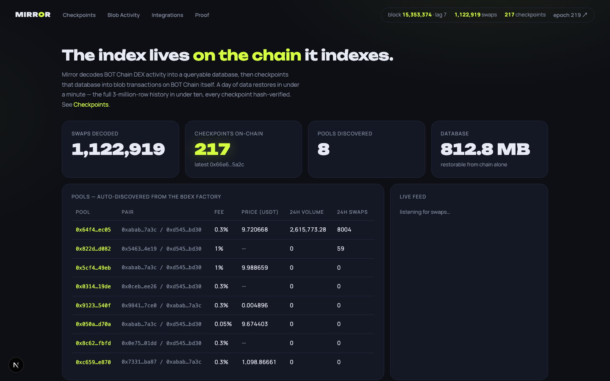
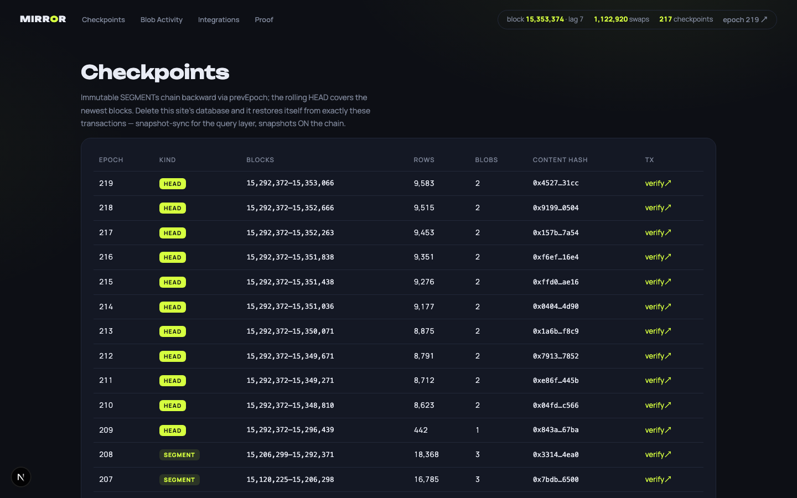
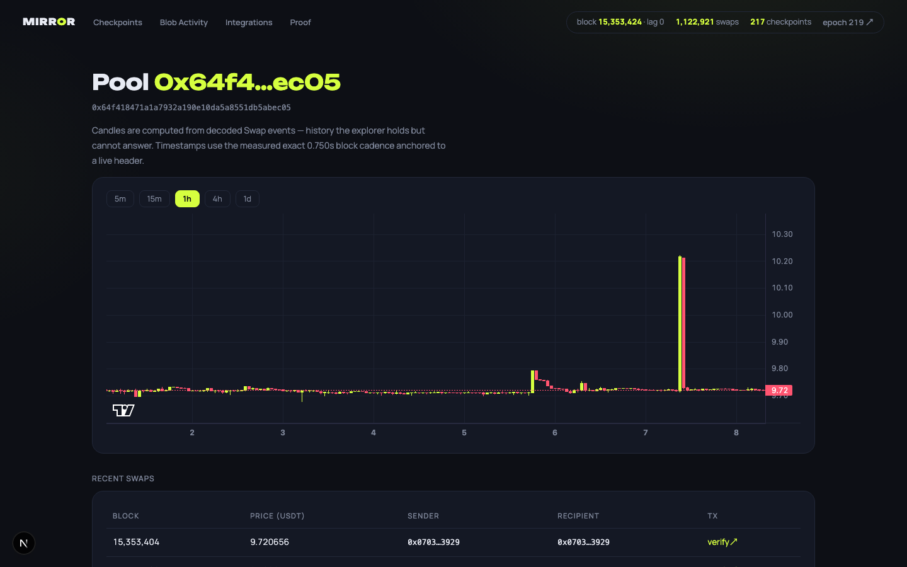
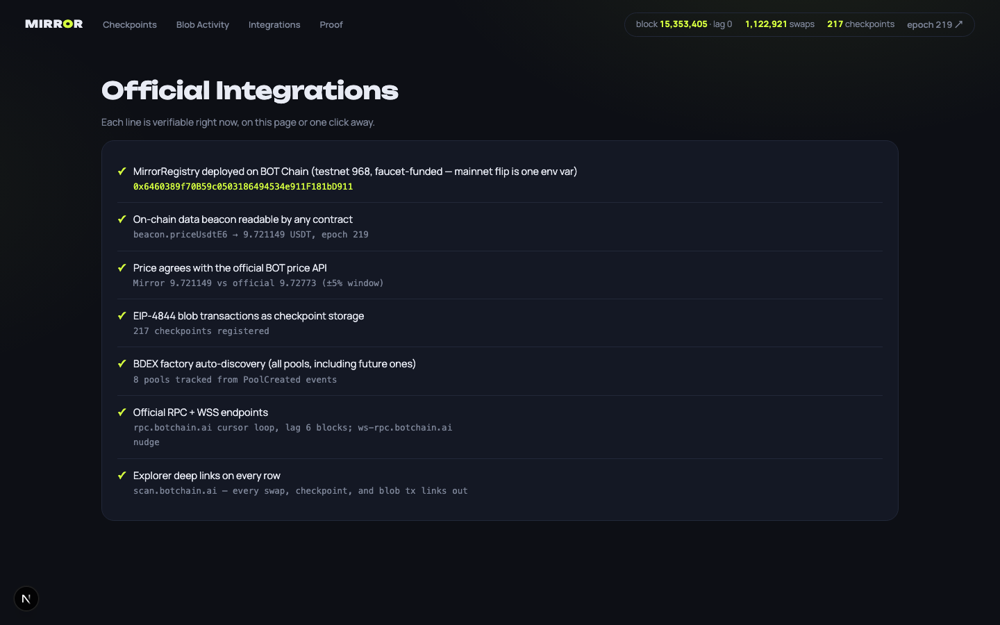

# Mirror: the BOT Chain indexer that stores itself on BOT Chain

Mirror decodes BOT Chain DEX activity into a queryable database, then periodically writes that database back into blob transactions on BOT Chain itself. Wipe the disk and Mirror rebuilds from the chain alone: a day of data returns in under a minute, the full three-million-row history in under ten. Every checkpoint is verified by content hash on the way back in. No snapshots, no S3 bucket, no trust in the operator.

[](https://www.typescriptlang.org/)
[](https://nextjs.org/)
[](https://soliditylang.org/)
[]()
[](LICENSE)



## What Is Mirror?

Indexers die. Databases get wiped, servers lapse, and every DEX dashboard you rely on is one missed invoice away from a blank page. Mirror treats the chain itself as the backup medium: the same BOT Chain that produced the swap events also carries compressed, hash-verified checkpoints of the decoded database inside EIP-4844 blob transactions. Anyone can run `npm run restore` and re-derive the entire query layer from public chain data, verifying every byte against on-chain content hashes.

1,122,000+ swaps decoded across 8 auto-discovered pools. 220+ checkpoints registered on-chain. Full-history restore measured at 575.3 seconds for 2,970,398 rows across 207 hash-verified checkpoints, with zero retries.

## Screenshots

| Checkpoints | Pool detail |
|------|------|
|  |  |
| Integrations | Overview |
|  |  |

## The Integrations

### EIP-4844 blob transactions as checkpoint storage

BOT Chain ships the full blob API (`eth_getBlobSidecarByTxHash`, `eth_blobBaseFee`). Mirror is built on it: checkpoints are gzip-compressed MIR1 envelopes packed into blob sidecars (126,975 usable bytes per blob, up to 3 blobs per transaction). Blob base fee on BOT Chain is 1 wei, so a full database checkpoint costs about a cent.

```ts
// daemon/src/chain.ts - read a checkpoint back from the chain
const sidecar = await rpc("eth_getBlobSidecarByTxHash", [txHash, true]);
const bytes = blobsToBytes(sidecar.blobSidecar.blobs);   // own decoder: viem's
const hash = keccak256(bytes);                            // fromBlobs truncates
if (hash !== onchain.contentHash) throw new BadHash();    // multi-blob payloads
```

### MirrorRegistry + on-chain data beacon

Every checkpoint is registered in `MirrorRegistry` (Solidity, 8 Foundry tests). The registry also carries a beacon struct with Mirror's latest aggregates, so other contracts can read DEX state without running an indexer. `BeaconReader` is a separately deployed consumer proving the composability:

```solidity
// contracts/src/BeaconReader.sol - any contract can do this
function wbotPriceE6() external view returns (uint64 price, uint64 asOfBlock, uint64 epoch) {
    IMirrorRegistry.Beacon memory b = registry.beacon();
    return (b.priceUsdtE6, b.lastIndexedBlock, b.latestEpoch);
}
```

### BDEX factory auto-discovery

Mirror watches the official BDEX (Uniswap-v3-style) factory for `PoolCreated` events and picks up new pools mid-chunk without a restart. All 8 pools in the table on the overview page were discovered this way, not configured.

### Official RPC, WSS, and price API

The ingestor runs a paced cursor loop against `rpc.botchain.ai` with adaptive chunk bisection (the RPC caps responses at 10 MB), nudged by `ws-rpc.botchain.ai` new-head events. The integrations page cross-checks Mirror's derived WBOT price against the official BOT price API and shows agreement within a 5 percent window, live.

## How It Works

```
            BOT Chain mainnet 677 (read side)
     ┌────────────────────────────────────────────┐
     │  BDEX pools ── Swap/Transfer/PoolCreated   │
     └──────────────────────┬─────────────────────┘
                            │ paced getLogs cursor loop
                            v
                 ┌─────────────────────┐     REST + WS :3400
                 │  mirrord (daemon)   ├──────────────────────► Next.js web
                 │  decode → SQLite    │   /pools /ohlcv /blobs   (6 pages)
                 └──────────┬──────────┘   /checkpoints /beacon
                            │ every ~400 blocks: MIR1 envelope
                            │ (varint+dict+gzip, keccak contentHash)
                            v
            BOT Chain testnet 968 (write side)
     ┌────────────────────────────────────────────┐
     │  blob tx (1-3 blobs)  +  MirrorRegistry    │
     │  sidecar carries data    registerCheckpoint│
     │                          + Beacon update   │
     └──────────────────────┬─────────────────────┘
                            │ wipe? crash? new machine?
                            v
                 ┌─────────────────────┐
                 │  npm run restore    │  walk epoch chain from latestEpoch,
                 │                     │  fetch sidecars, verify contentHash,
                 └─────────────────────┘  rebuild DB, resume live tail
```

SEGMENT checkpoints are immutable closed block ranges chained by `prevEpoch`. A rolling HEAD checkpoint covers the newest blocks. Restore walks the chain backward from `latestEpoch()`, so it discovers exactly the live set. A calldata mirror of the latest HEAD guards against blob retention expiry.

## Tech Stack

| Layer | Technology |
|-------|-----------|
| Daemon | TypeScript, Node 24, viem, better-sqlite3, Fastify (REST + WebSocket), c-kzg |
| Contracts | Solidity 0.8, Foundry (MirrorRegistry, BeaconReader, DemoToken) |
| Web | Next.js 15, lightweight-charts |
| Storage | SQLite locally; EIP-4844 blob sidecars + calldata mirror on-chain |
| Infra | Docker Compose (daemon + web, healthchecked) |

## Testing

```bash
cd daemon && npm test        # 6 passing - MIR1 codec round-trip incl. offline blob leg
cd contracts && forge test   # 8 passing - checkpoint chain, beacon, access control
```

The codec suite proves an envelope survives encode, blob packing, unpacking, and decode byte-identically and stays inside the compression budget. The contract suite covers epoch ordering, hash storage, writer gating, and the BeaconReader consumer path.

## Try It (10 minutes)

1. Clone and configure:
   ```bash
   git clone https://github.com/dmustapha/mirror && cd mirror
   cp .env.example .env   # works read-only out of the box; add a key only to write checkpoints
   ```
2. Point it at the live registry (already deployed, already full of checkpoints):
   ```bash
   # in .env
   REGISTRY_ADDRESS=0x6460389f70B59c0503186494534e911F181bD911
   REGISTRY_DEPLOY_BLOCK=15492396
   ```
3. Restore the database from chain data alone. Watch per-epoch `hash✓` lines print:
   ```bash
   cd daemon && npm install && npm run restore
   ```
4. Start the daemon and open the dashboard:
   ```bash
   npm run daemon           # API on :3400, resumes the live tail
   cd ../web && npm install && npm run dev   # dashboard on :3401
   ```
5. Or bring up everything with Docker:
   ```bash
   docker compose up
   ```
6. Read the beacon from the chain directly, no Mirror needed:
   ```bash
   cast call 0x6460389f70B59c0503186494534e911F181bD911 "beacon()((uint64,uint128,uint32,uint64,uint64))" --rpc-url https://rpc.bohr.life
   ```

## API Reference

| Method | Endpoint | Description |
|--------|----------|-------------|
| GET | `/pools` | All auto-discovered pools with price and 24h aggregates |
| GET | `/pools/:addr/swaps` | Decoded swaps, explorer deep link per row |
| GET | `/pools/:addr/ohlcv?interval=1h&buckets=200` | Candles over the full decoded history |
| GET | `/transfers/:addr` | USDT transfers touching an address |
| GET | `/checkpoints` | The on-chain checkpoint chain, newest first |
| GET | `/blobs` | Every blob transaction Mirror has seen (its own checkpoints) |
| GET | `/beacon` | On-chain beacon vs local aggregates, side by side |
| GET | `/status` | Head, lag, row counts, database size |
| GET | `/proof` | Machine-readable twin of `daemon/submission/proof.md` |
| WS | `/ws` | Live swap and checkpoint feed |

## Smart Contracts

| Contract | Address (BOT Chain testnet 968) | Description |
|----------|--------------------------------|-------------|
| MirrorRegistry | `0x6460389f70B59c0503186494534e911F181bD911` | Checkpoint chain, content hashes, beacon, calldata mirror head |
| BeaconReader | `0xC76FE7B723388C656FcF79bdB10DF52329369D67` | Independent consumer contract reading the beacon |
| DemoToken | `0xd4cff27b91f70629EEA4C63B2241CBAeCE4A57B9` | Demo ERC-20 for on-camera pool discovery |

## On-Chain Verification

| What | Link |
|------|------|
| First blob transaction (1-blob probe) | [`0x5fceb6...66881a`](https://scan.botchain.ai/tx/0x5fceb6f2387bd2d4c618ae0d4da90186ea0745c22f4b9c028059c459a266881a) |
| First 3-blob transaction | [`0x5fee81...da08e7`](https://scan.botchain.ai/tx/0x5fee819229e92143d5425d5f5389c6a1d8b673ffa766b0e97e54e64ef9da08e7) |
| Every checkpoint, epoch by epoch | [`daemon/submission/proof.md`](daemon/submission/proof.md) (600+ transaction links) |
| Timed restore reports | [`daemon/submission/proof.md`](daemon/submission/proof.md), measured numbers only |

## Running Locally

```bash
git clone https://github.com/dmustapha/mirror && cd mirror
cp .env.example .env
cd daemon && npm install && npm run daemon
cd ../web && npm install && npm run dev
```

### Required Environment Variables

| Variable | Description |
|----------|-------------|
| `RPC_URL` / `WSS_URL` | Read side: official BOT Chain mainnet endpoints (defaults work) |
| `WRITE_RPC_URL` / `WRITE_CHAIN_ID` / `WRITE_EXPLORER_BASE` | Write side: where checkpoints and the registry live (testnet 968 by default; mainnet flip is these 3 vars) |
| `PRIVATE_KEY` | Funded key for writing checkpoints. Restore and read paths need no key |
| `REGISTRY_ADDRESS` / `REGISTRY_DEPLOY_BLOCK` | MirrorRegistry address and deploy block |
| `START_BLOCK` | Backfill start (defaults to BDEX factory deploy) |
| `CHECKPOINT_MODE` | `blob` (default) or `calldata` fallback |
| `API_PORT` / `NEXT_PUBLIC_API_URL` | Daemon API port and the URL the web app calls |

## Project Structure

```
mirror/
├── daemon/            # mirrord: ingest, decode, checkpoint, restore, API
│   ├── src/
│   │   ├── ingest.ts      # cursor-loop ingestor, pool auto-discovery, WSS nudge
│   │   ├── codec.ts       # MIR1 envelope: varint+dict+gzip, keccak contentHash
│   │   ├── checkpoint.ts  # SEGMENT/HEAD lifecycle, BlobSink + CalldataSink
│   │   ├── restore.ts     # epoch-chain walk, hash-verified blob pulls
│   │   ├── api.ts         # Fastify REST + WS feed
│   │   └── store.ts       # SQLite schema and queries
│   ├── scripts/           # hour-0 spike, demo-state verifier, pool creator
│   └── submission/        # proof.md: every checkpoint tx, timed restore reports
├── contracts/         # Foundry: MirrorRegistry, BeaconReader, DemoToken + 8 tests
├── web/               # Next.js dashboard: overview, pool detail, checkpoints,
│                      # blob activity, integrations, proof
└── docker-compose.yml # daemon + web, healthchecked
```

Network context: BOT Chain mainnet is chain 677 (`https://rpc.botchain.ai`, explorer `https://scan.botchain.ai`). The checkpoint registry lives on BOT Chain testnet 968 (`https://rpc.bohr.life`), which the event rules accept; moving to mainnet is a three-variable env change.

Built for the [BOT Chain Builder Challenge #1](https://rapid-change-2c1.notion.site/BOT-Chain-Builder-Challenge-1-38846f6c38d580c99a84d5022ba83ac5).

## License

MIT
